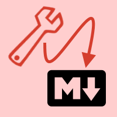
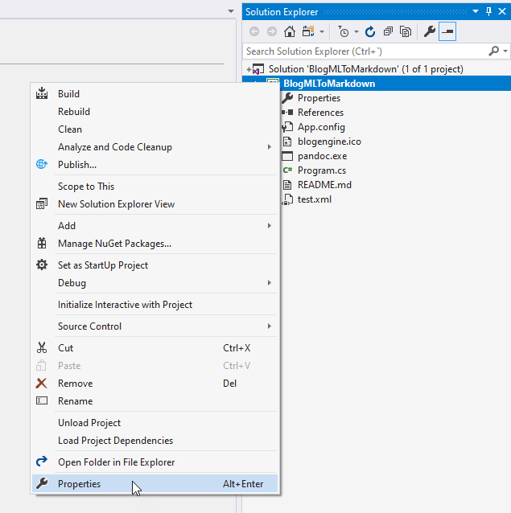
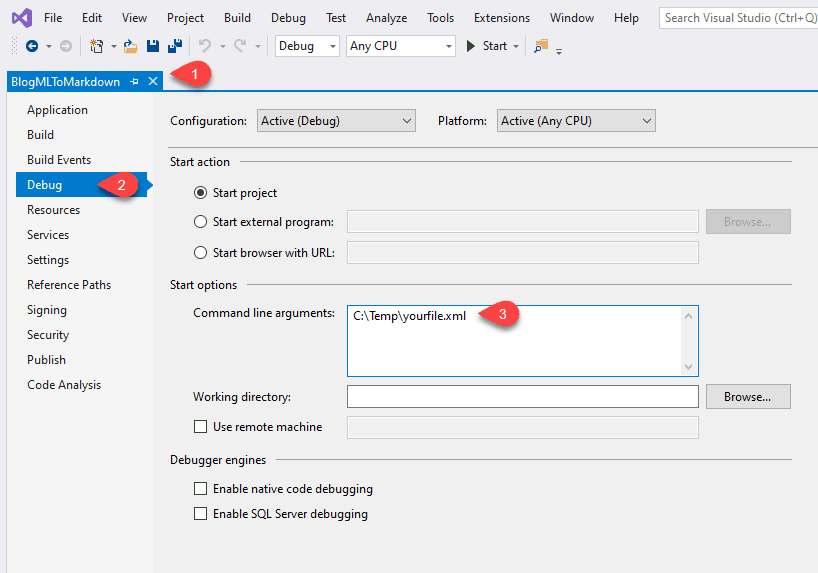

# BlogEngine-BlogML2Markdown



C# command-line tool that converts a BlogML `.xml` file from BlogEngine to markdown files for [MIIS](https://github.com/jmalarcon/miis), Jekyll, Hugo, etc...

It uses [pandoc](https://pandoc.org) for transforming HTML into Markdown. It's not 100% perfect but you will get pretty good markdown files with very few issues. **This tool does not export comments** (yet).

>This was originally **based on this [repo by Pablo Cibraro](https://github.com/pcibraro/BlogMLToMarkdown)**, but couldn't make it work for pull requests, and it seems like abandoned. 

I've improved a lot of details in the export process and data and made it more BlogEngine specific although it'll work with any BlogML generating blog system.

## How to use it

>**Important**: I'm attaching a compiled version in the "release" section of this repo. However I highly recommend to run it from Visual Studio, using the source code. If something fails you should be able to see exactly what happened and fix it. This is a rough and quick exporter, so maybe some issues may arise. On the other hand you'll be able to tweek the results, for example, changing the name of the `images` folder, or th enames of the resulting markdown files folders.

### 1. Export your blog to BlogML

Go to the administration area of your BlogEngine blog and access the `Configuration·Advanced`section. Scroll down to the latest option `Export`. Clicking on this button will generate an `.xml` file on the fly that you must download to your hard drive.

### 2. Run `BlogMLToMarkdown.exe`

You need to specify the name or path of the .xml file as a parameter. If the file is in the same folder as the `.exe`, just the name is enough. If not, you should specify a full or relative path:

```bash
BlogMLToMarkdown.exe C:\Temp\MyBlogExport.xml
```

If you run the program from within Visual Studio, you should change the debug parameters for the project, by clicking with the secondary mouse button over the project root node:



and then going to `Debug` and `Start options`:



where you can put the path to your file.

### 3. Run the app and wait for a while

It taks around 10 seconds per post depending on it's length due to the use of pandoc, but since this is one in a lifetime, it shouldn't matter a lot.

You'll see every post title and a progress while they are being processed and, at the end, you'll get an `output` folder with a maximum of three subfolders under it:

- `posts`: in this folder you'll find all the files that are marked as posts in BlogEngine and are published. So, the posts for your new blog!
- `other`: other kinds of publications in your current site, mainly content marked as "Page" in BlogEngine.
- `NotPublished`: Everything that is not published or approved is generated into this folder. It makes easy to find all your unpublished content and decide if you want to keep it in your new site or not (or just make a backup of it in Markdown format).

### 4. Copy images

By default, the app assumes your images are located into an `images` folder under your `posts` folder. Therefore the tool changes all the `image.axd` kind of image pointers to the `images/` folder.

So, to crrectly have all your images in your new site, just copy the contents of the `App_Data/files` folder in your previous BlogEngine server, into an `images` folder inside the `posts` folder. That's it!

The tool adds an `image` field into the resulting `.md` files front-matter pointing to the first image inside your content, so that it will be used as the main distinguished image of each post, because a lot of MIIS/Jekyll templates use this field with that purpose.

>**Note**: The provided `test.xml` file is in Spanish, from my old blog, sorry. It only has 3 sample posts, but I've tested it with almost one thousand posts in two different BlogEngine blogs and it went OK.

Hope this helps!